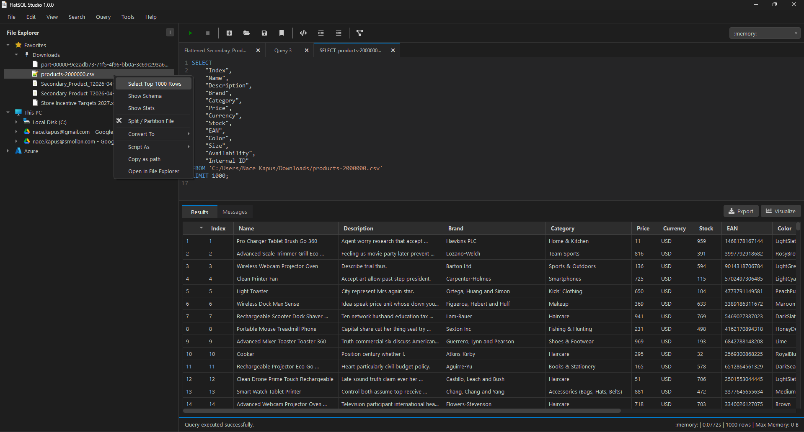

# FlatSQL Studio

[](LICENSE)

A full-featured GUI SQL IDE built for the DuckDB-native workflow.



> **Platform support:** Windows only for now. macOS support is planned.

## Key Features

- DuckDB-powered SQL execution.
- Multi-tab SQL editor with syntax highlighting and formatting.
- File Explorer and Database Explorer side panels.
- Results grid, messages panel, and profiling/visualization tools.
- Theme support with multiple bundled themes.
- Export to CSV, Parquet, JSON, and Excel.
- Ability to mount external file systems (for example Azure) and databases (for example DuckDB and Databricks).

## Tech Stack

- GUI: PySide6
- Query Engine: DuckDB
- Data Processing: Polars
- SQL Formatting: SQLFluff
- Visualization: Matplotlib

## Installation

```bash
pip install -r requirements.txt
python run.py
```

## Architecture

See [ARCHITECTURE.md](ARCHITECTURE.md) for a full walkthrough of the codebase.

## Contributing

Contributions are welcome. Please see [CONTRIBUTING.md](CONTRIBUTING.md) for the contribution workflow and project expectations.

## License

FlatSQL Studio is licensed under the MIT License. See [LICENSE](LICENSE) for details.

## Roadmap

- macOS support.
- Additional connectors (AWS, GCP, and more).
- Built-in Delta support.
- Additional database explorer functionality.
- Flat file pivot tables.
- Data and schema compare tools.
- Advanced snippet functionalities (for example parameters).
